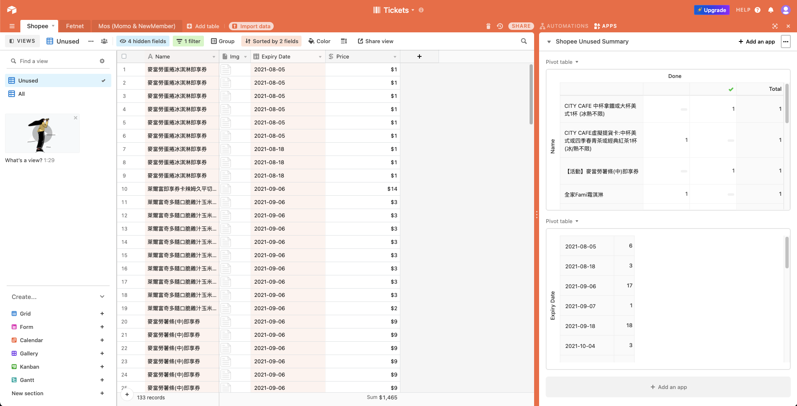

# Purpose

Update my airtable's shopee tickets base.

**Next action items are**  

1. I need to consider merge used tickets into one record  
when record count is already over 1200 (Free pricing plan limitation).
2. Consider use local tinydb handle done and returned items let we can only store one summary record on airtable 

